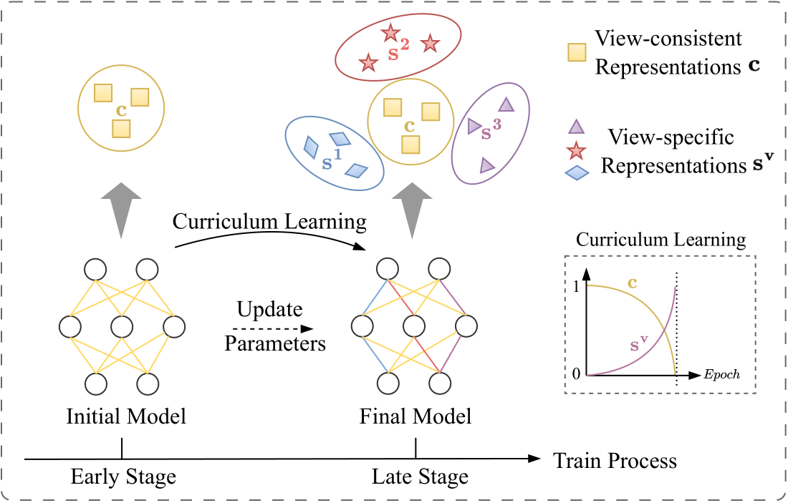
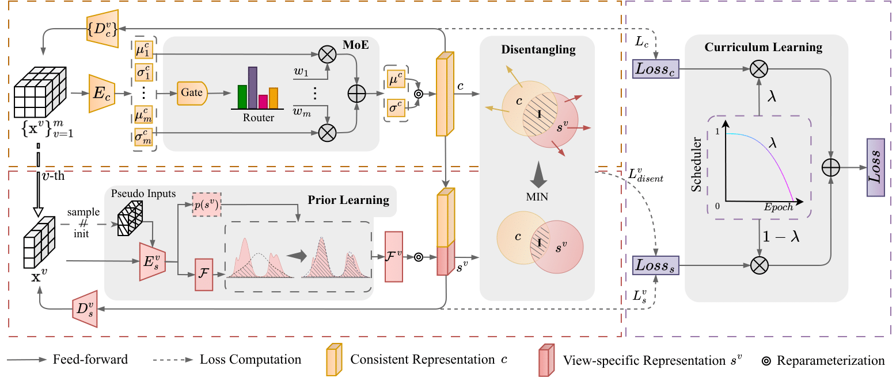

# CL2P

PyTorch implementation for the paper "[Disentangling Multi-view Representations via Curriculum Learning with Learnable Prior](https://www.ijcai.org/proceedings/2025/0586.pdf)" (IJCAI 2025)

### Table of contents
* [Introduction](#star2-introduction)
* [Roadmap](#compass-roadmap)
* [Installation](#gear-installation)
* [Dataset and model](#floppy_disk-dataset-and-model)
* [Usage](#zap-usage)
* [Performance](dart-performance)
* [Contact](#raising_hand-questions)


## :star2: Introduction
<table>
  <tr>
    <td width="50%">
    <b><i>Property 1. DNNs tend to prioritize memorization of simple instances first and then gradually memorize hard instances.</i></b>
    This work reveals a coupling between neural networks’ “easy-to-hard” preference in learning and the trade-off of view consistency vs. specificity. 
    </td>
    <td width="50%">
    
    Figure 1: Curriculum learning over view-consistency and view-specificity. The model initially memorizes simple patterns, i.e., view-consistency $c$. As training progresses, the model gradually memorizes hard patterns, i.e., view-specificity $s^v$. Such a learning strategy is similar to humans. It facilitates the model in memorizing simple and hard patterns to enhance overall performance.
    </td>
  </tr>
</table>


Figure 2: An overview of the proposed CL2P. It mainly consists of four parts: 1) Curriculum learning, which adjusts the whole model to first learn the simple view-consistent representations $c$ and then hard view-specific representations $\{s^v\}^m_{v=1}$ progressively, 2) Mixture-of-Experts (MoE), which integrates all views into a consistent representation $c$ for multi-view data, 3) Pseudo-inputs, which together with view-specific representation learning drive optimal prior for different views, and 4) Disentangling module, which reduces the redundancy between viewconsistent representation $c$ and view-specific representation $\{s^v\}^m_{v=1}$.

## 	:compass: Roadmap
This is our code structure:
```
CL2P/
├── configs/ # Contains model configuration files for datasets.
├── data/ # Datasets, data processing, model loader.
|	└── datatool.py 
├── models/ # Contains the model architecture.
|	├── autoencoder.py 
|	├── consistency_models.py 
|	├── ms_estimators.py 
|	├── model.py  
|	└── specificity_models.py  
├── utils/ # Includes utility functions for evaluation and metrics.
|	├── metrics.py 
|	├── misc.py 
|	├── optimizer.py  
|	└── visualization.py 
├── README.md === THIS file!
├── test.py === The script for evaluating the trained model.
└── train.py === The script for training the model.

```

## :gear: Installation
* python == 3.10.15
* torch == 2.1.0
* torchvision == 0.16.0
* scikit-learn == 1.5.2
* scipy == 1.14.1

We also export our conda virtual environment as CL2P.yaml. You can use the following command to create the environment.
```bash
conda env create -f CL2P.yaml
```

## :floppy_disk: Dataset and model
You could find the Office-31 dataset we used in the paper from [Baidu Netdisk](https://pan.baidu.com/s/1lcE6gEwuO0k1nR_m17gtKw?pwd=hwvx), and the pre-trained models from [Baidu Netdisk](https://pan.baidu.com/s/10FRHrgtLhAE08ENblP4vsg?pwd=3utf).

## :zap: Usage
### Training
To train the model, use the following command:

```bash
python train.py -f configs/Edge-MNIST.yaml
```
This will start the training process using the configuration specified in `configs/Edge-MNIST.yaml`.

### Testing
To test the trained model, use the following command:
```bash
python test.py -f configs/Edge-MNIST.yaml
```
This will load the trained model and test it using the configuration specified in `configs/Edge-MNIST.yaml`.

## :dart: Performance
NMI: Clustering nmi. ACC: Classification accuracy.
<table>
  <tr>
    <th rowspan="2">Method</th>
    <th colspan="2">Edge-MNIST</th>
    <th colspan="2">Edge-Fashion</th>
    <th colspan="2">Multi-COIL-20</th>
    <th colspan="2">Multi-COIL-100</th>
    <th colspan="2">Multi-Office-31</th>
  </tr>
  <tr>
    <th>NMI</th><th>ACC</th>
    <th>NMI</th><th>ACC</th>
    <th>NMI</th><th>ACC</th>
    <th>NMI</th><th>ACC</th>
    <th>NMI</th><th>ACC</th>
  </tr>
  <tr>
  <tr>
  <td>Beta-VAE</td> 
    <td>   53.92 </td>   <td>   94.00  </td> 
    <td>   55.21  </td>   <td>   80.84  </td> 
    <td>   77.80  </td>   <td>   88.74 </td> 
    <td>   80.62 </td>   <td>   79.27 </td> 
    <td>   28.12  </td>   <td>   40.00    </td>    
  </tr>
      <tr>
<td>Joint-VAE </td>  
        <td>   14.58  </td> 
        <td>   95.30  </td>   <td>   24.10  </td> 
        <td>   79.82   </td> <td>   64.46  </td> 
        <td>   53.68   </td>  <td>   70.71 </td> 
        <td>   36.20   </td>  <td>   27.24 </td> 
        <td>   25.67    </td> 
      </tr>
<tr>
  <td>MFLVC </td>  <td> 29.00 </td>  <td>   55.30 </td>    <td>   27.03   </td>  <td>  41.95</td>  <td>   75.07   </td>  <td> 55.84 </td> <td>   81.97 </td>    <td>   29.84 </td>    <td>  34.79  </td>  <td>  32.02  </td>  
  </tr>
<tr>
  <td>GCFAgg </td> <td>   24.93 </td>   <td>   75.86 </td>    <td>   34.83 </td>    <td>   78.85</td>    <td>   78.77  </td>   <td>   61.69 </td>    <td>   82.16  </td>  <td>   48.37 </td>    <td>   45.55 </td>    <td>   54.38  </td> 
  </tr>
<tr>
  <td>SCM </td> <td>   29.58 </td>   <td>   89.39 </td>    <td>   32.16  </td>   <td>   81.56 </td>   <td>   68.08 </td>    <td>   78.79  </td>   <td>   81.72 </td>   <td>   63.54  </td>   <td>   21.01  </td>   <td>   21.89 </td> 
  </tr>
  <tr>
<td>CSOT </td> <td> 32.35</td>  <td>   54.83 </td>    <td>   37.80  </td>   <td> 58.86</td>  <td>    63.15  </td>   <td> 35.06 </td>  <td>   75.17  </td>   <td>   33.16   </td>  <td>  15.48   </td>   <td>  25.10  </td> 
</tr>
  <tr>
<td>MVAE </td> <td> 45.15</td>  <td>   97.76 </td>    <td>   55.25  </td>   <td> 88.93</td>  <td>   77.32 </td>    <td>   93.37    </td> <td> <i>84.74<i> </td> <td>   <i>92.23<i>  </td>   <td>   <i>46.24<i>  </td>   <td> <i>88.41<i>  </td>  
</tr>
  <tr>
<td>DVIB </td> <td> 20.00</td>  <td>   76.19 </td>    <td>   23.51 </td>    <td> 71.68 </td> <td>   67.43 </td>    <td>   71.86 </td>    <td> 73.13</td>  <td>   72.69 </td>    <td>   22.10  </td>   <td> 37.03    </td> 
</tr>
  <tr>
<td>Multi-VAE </td> <td> 61.71</td>  <td>   95.76  </td>   <td>   40.69  </td>   <td> 84.69 </td> <td>   79.91 </td>    <td>   88.31  </td>   <td>  70.01</td>  <td>   74.93 </td>    <td>   33.30  </td>   <td>  61.46  </td> 
</tr>
  <tr>
<td>MRDD </td> <td> <i>64.18<i> </td> <td>   <i>98.53<i>   </td>  <td>   60.51 </td>    <td> 88.81 </td> <td>   79.42 </td>    <td>   <i>94.38</td>     <td> 84.64</td>  <td>   91.11  </td>   <td>   40.22  </td>   <td> 82.46 </td> 
</tr>
  <tr>
<td>CL2P-C </td> <td> 58.91</td>  <td>   <b>98.67</b> </td>   <td>  <i>62.45<i> </td>   <td> <i>89.35<i> </td> <td>   <b>83.24</b>  </td>  <td>   <b>96.36<b> </td>    <td> <b>85.71<b> </td> <td>   <b>93.12<b> </td>    <td>  37.31 </td>   <td> 73.99 </td> 
</tr>
  <tr>
<td>CL2P-CS </td> <td> <b>67.50</b> </td> <td>   98.50 </td>   <td>  <b>65.53<b>  </td>  <td> <b>90.56<b> </td> <td>   <i>80.39<i>  </td>   <td>   92.40 </td>    <td> 82.74</td>  <td>   89.81 </td>    <td>  <b>50.57<b> </td>   <td> <b>93.42<b>  </td> 
</tr>
</table>


## :raising_hand: Questions
Should you have any questions, please feel free to contact me (kaiguo.gm@gmail.com).

## :books: Citation
If you find CL2P useful in your research, please consider giving it a ⭐️ and citing:
```latex
@inproceedings{guo2025disentangling,
  title={Disentangling Multi-view Representations via Curriculum Learning with Learnable Prior},
  author={Guo, Kai and Wang, Jiedong and Peng, Xi and Hu, Peng and Wang, Hao},
  journal={Proceedings of the 34th International Joint Conference on Artificial Intelligence},
  year={2025}
}
```

## :sparkles: Acknowledgements
The codes are based on [MRDD](https://github.com/Guanzhou-Ke/MRDD). Thanks to the authors for their codes!
